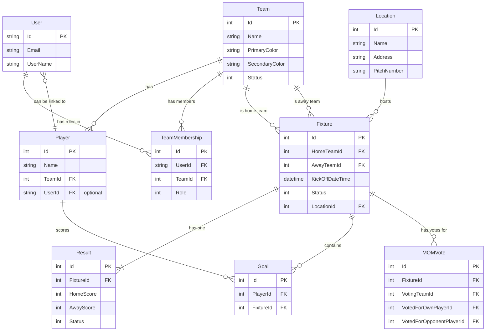

# Database Schema Documentation

This document describes the current, live schema for the League Manager application. The database is designed to support a user-driven league with team-specific roles and detailed match tracking.

---

## 1. Current Schema

This diagram illustrates the tables and relationships that are currently implemented in the database.

---

## 2. Key Relationships & Concepts

* **Player vs. User Separation:** A `Player` is a roster entity (a name on a list) and does not require a user account. A `User` is an authentication entity (an account that can log in). The nullable `UserId` on the `Player` table allows a registered user to "claim" their player profile.

* **Team-Specific Roles:** The `TeamMembership` table is the core of our granular permission system. It creates a many-to-many relationship between `User`s and `Team`s, assigning a specific role (e.g., `Leader`, `AssistantLeader`) to a user for one particular team. This is what allows a user to be a leader of one team but just a member of another.

* **Fixture & Result Lifecycle:** A `Fixture` is a scheduled event. Once a match is played and a result is submitted, a single `Result` record is created and linked back to that `Fixture`. The league table calculations are only performed on `Result`s that have an `Approved` status.

---

## 3. Future Additions

The schema is designed to be extensible. Future development phases will introduce new concepts, including:

* **Seasons:** A `Season` table will be added, with junction tables like `SeasonTeam` and `SeasonPlayer` to create season-specific rosters and standings.
* **Attendance & Availability:** Tables to track player attendance for matches and team availability for scheduling.
* **User-Driven Roster Management:** Tables to manage `JoinRequest`s from players and `TransferAppeal`s from Team Leaders.
